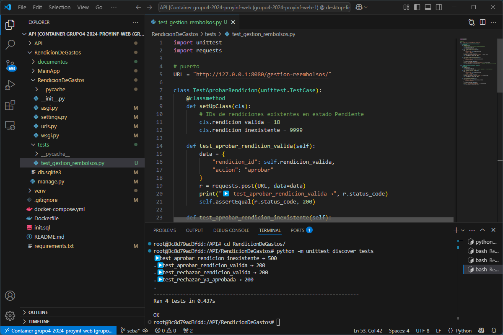

# INF225 - Hito 3 - Pruebas Unitarias - 

## Historia de Usuario seleccionada

**HU:** Yo como Validador, quiero ver y procesar las rendiciones pendientes para validar que cumplan con los límites de presupuesto y políticas de la empresa, aceptándolas o rechazándolas.  
**Justificación:** Esta HU permite implementar una funcionalidad crítica del sistema, permitiendo que las rendiciones sean gestionadas correctamente.  
**Tareas asociadas:**

- Crear vista para listar rendiciones pendientes
- Implementar acciones de aceptar y rechazar rendiciones
- Registrar estado en base de datos
- Imprimir notificaciones simuladas al Presupuesto Central y al solicitante
- Exponer endpoint `/gestion-reembolsos/` para gestión

---

## Pruebas Unitarias Implementadas

Las pruebas se implementaron con `unittest` en Python, utilizando el módulo `requests`. Todas las pruebas están en `tests/test_gestion_reembolsos.py`.  
Se utilizó `setUpClass()` para preparar los IDs y los datos.

**Endpoint probado:** `POST /gestion-reembolsos/`  
**Ambiente:** Docker local – servidor corriendo en `http://127.0.0.1:8080`  

### Casos de Prueba

| Nº | Escenario                        | Entrada                          | Acción                   | Salida esperada                       | Resultado |
|----|----------------------------------|----------------------------------|--------------------------|----------------------------------------|-----------|
| 1  | Aprobar rendición válida         | rendicion_id=18, accion=aprobar  | POST `/gestion-reembolsos/` | Código 200 OK, cambio de estado        | ✅ OK     |
| 2  | Aprobar rendición inexistente    | rendicion_id=9999, accion=aprobar| POST `/gestion-reembolsos/` | Código 500 (DoesNotExist)              | ✅ OK     |
| 3  | Rechazar rendición válida        | rendicion_id=19, accion=rechazar | POST `/gestion-reembolsos/` | Código 200 OK, cambio de estado        | ✅ OK     |
| 4  | Rechazar rendición ya aprobada   | rendicion_id=18, accion=rechazar | POST `/gestion-reembolsos/` | Código 200 OK, estado no cambia        | ✅ OK     |

---

## Captura de resultados

---

## Registro del trabajo realizado

| Tarea                                      | Tiempo estimado |
|-------------------------------------------|------------------|
| Implementación de vista y lógica HU       | 3 horas          |
| Diseño de 4 pruebas unitarias             | 3 horas        |
| Configuración y ejecución de pruebas      | 30 minutos       |
| Redacción de documentación y análisis     | 1 hora       |

**Total estimado:** 7 horas 30 minutos

---

